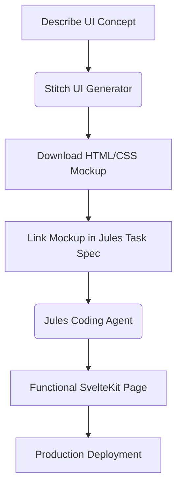

# Stitch & Jules: Design-to-Code Delegation Workflow

This guide details the standard workflow for pairing **Stitch** (AI Design Agent) and **Jules** (AI Coding Agent) to design, prototype, and implement user interfaces in the Substrate project.



---

## 1. Roles

| Agent | Tool | Responsibility |
|---|---|---|
| **Stitch** | `stitch_submit.py` | Visual prototyping — generates static HTML/CSS mockups from prompts |
| **Jules** | `jules_submit.py` | Full-stack implementation — ports mockups to Svelte, wires Go APIs, writes tests |
| **Antigravity** | IDE | Architecture, specs, complex debugging, reviewing Jules PRs |

---

## 2. Step-by-Step Pipeline

### Step 1: Initialize or Identify a Stitch Project
```bash
python3 stitch_submit.py --list
python3 stitch_submit.py --create "Substrate Dashboard — Dependency Graph"
```

### Step 2: Generate Mockups using Stitch
```bash
python3 stitch_submit.py --generate \
  --project-id <project_id> \
  --prompt "Create a dependency graph dashboard page. Dark theme (#0F1117 background), teal accent (#00BFA5). Left sidebar shows connected repositories. Main panel shows an interactive node graph with services as circles connected by directed arrows. Each node shows service name, language badge, and health status dot."
```

### Step 3: Download the Mockup
```bash
curl -o temp_mockups/dependency_graph.html "<download_url>"
```

### Step 4: Submit the Coding Task to Jules
Reference the mockup file path in the Jules prompt. Example:
> *"Implement the Dependency Graph page at `dashboard/src/routes/graph/+page.svelte`.
> A visual mockup is at `temp_mockups/dependency_graph.html`. Port the HTML/CSS layout into SvelteKit. Wire the graph nodes to the Go API at `GET /api/graph` as defined in `docs/specs/api-schema.md`."*

---

## 3. Best Practices

- **Stitch = visuals only.** No JS event handlers, DB bindings, or state. Keep prompts focused on layout, colors, and components.
- **Jules = implementation only.** Always provide the spec file reference from `docs/specs/` so Jules implements against the contract, not from its own assumptions.
- **Spec-First Gate:** If a Jules PR introduces a structural change (new API field, DB column) that is not in `docs/specs/`, reject the PR and update the spec first.
